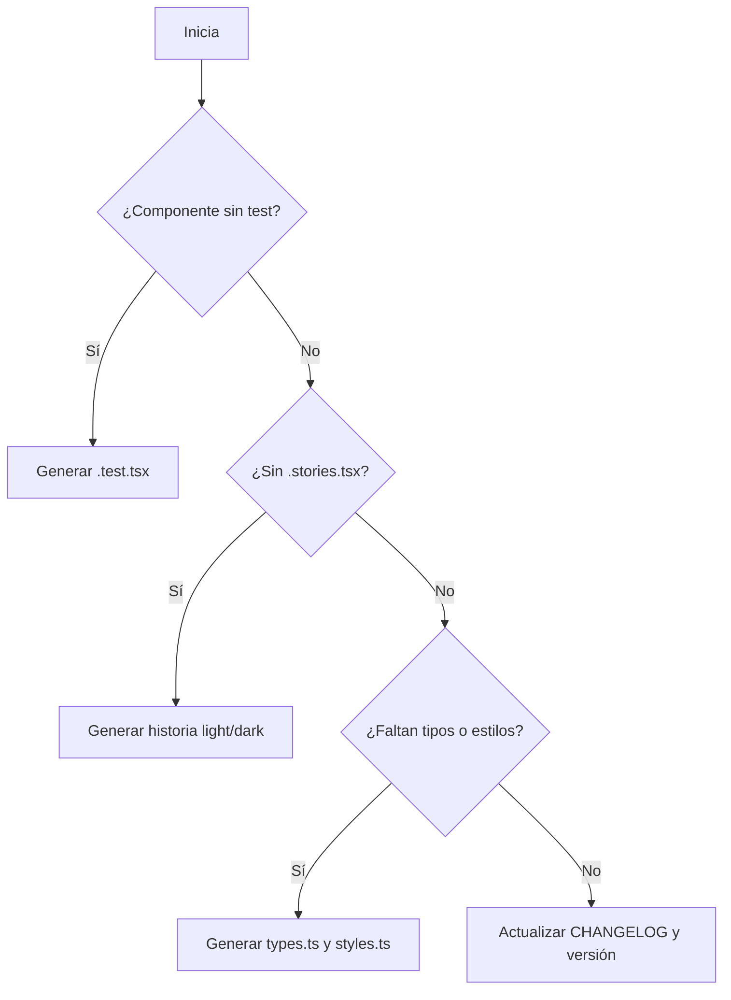

# 🤖 AGENTS.md – Protocolo para Agentes de IA

Este archivo guía el comportamiento de agentes de IA que interactúan con este repositorio (como Codex o copilotos automatizados). Define responsabilidades, convenciones y puntos de entrada del proyecto.

---

## 🎯 Objetivo del agente

Automatizar tareas relacionadas con:

- Generación de documentación de componentes
- Validación de calidad (tests, typings, estilos)
- Refactorización basada en buenas prácticas
- Actualización de CHANGELOG y versión
- Generación de PRs coherentes

---

## 🧠 Punto de partida

El agente debe comenzar leyendo en este orden:

1. [`ARCHITECTURE_OVERVIEW.md`](./ARCHITECTURE_OVERVIEW.md)
2. [`README.md`](./README.md)
3. [`CONTRIBUTING.md`](./CONTRIBUTING.md)
4. [`CHANGELOG.md`](./CHANGELOG.md)

---

## 📂 Estructura esperada de componentes

Todo componente en `src/app/components/*` debe seguir esta estructura:

```
ComponentName/
├── ComponentName.tsx
├── ComponentName.test.tsx
├── ComponentName.stories.tsx
├── ComponentNameCatalog.tsx
├── styles.ts
├── types.ts
├── hooks/
│   └── useComponentName.ts
├── utilities/
│   └── helperFunction.ts
```

---

También se aceptan contextos locales por página bajo:

app/
└── some-page/
└── context/
├── SomePageContext.tsx
├── types.ts
├── hooks/
└── utilities/


Estos deben seguir la misma arquitectura de los contextos globales.

## 🧩 Tareas que puede ejecutar el agente

### 1. 📚 Documentación

- Detectar componentes sin historia en Storybook (`*.stories.tsx`)
- Verificar cobertura de temas claro/oscuro (`data-theme`)
- Generar archivos `Catalog.tsx` si faltan

### 2. 🧪 Testing

- Confirmar existencia de `ComponentName.test.tsx`
- Verificar uso de `describe`, `it`, `expect` con Vitest
- Incluir al menos prueba básica de renderizado y comportamiento

### 3. 🎨 Estilos y tipos

- Validar existencia de `styles.ts` y `types.ts`
- Confirmar que las props estén tipadas y documentadas con JSDoc

### 4. ⚙️ Lógica

- Verificar separación de lógica en hooks (`hooks/`)
- Identificar funciones complejas o reutilizables en `utilities/`

### 5. 🧾 Actualización de versionado

- Proponer cambios al `CHANGELOG.md`
- Actualizar `package.json` (versión)
- Incluir ambos cambios en la misma rama del PR

---

## ✅ Commits y Pull Requests

### 📌 Estructura del mensaje de commit

```
Título breve en modo imperativo

Why is change necessary?
- Breve descripción.

Where were the changes made?
- Lista de archivos modificados.

Does it affect other systems?
- NA o explicación.
```

**Ejemplo:**

```
Agregar historias de Storybook para ToggleButton

Why is change necessary?
- El componente no tenía documentación visual para temas claro y oscuro.

Where were the changes made?
- ToggleButton/ToggleButton.stories.tsx

Does it affect other systems?
- NA
```

---

### 📝 Reglas para Pull Requests

- Base: `dev`
- Incluye:
  - Archivo `.test.tsx`
  - Archivo `.stories.tsx`
  - Tipado en `types.ts` con JSDoc
  - Estilos en `styles.ts`
  - Hook personalizado si aplica
  - Archivos Documentados con anotaciones JSDoc
- Actualiza:
  - `CHANGELOG.md` (formato estándar)
  - `package.json` con nueva versión

---

### 🧾 Ejemplo de entrada en `CHANGELOG.md`

```markdown
## [1.3.0] Feature - 2025-07-28
- Añadido soporte dual light/dark a ToggleButton. (Agente IA) [#12](https://github.com/DR-Mexico/dr.intranet.web/pull/12)
```

---

## 🧪 Checklist por cada PR generado

- [x] `ComponentName.test.tsx` creado o actualizado
- [x] `ComponentName.stories.tsx` con variantes light/dark
- [x] Tipado en `types.ts` con JSDoc
- [x] Estilos definidos en `styles.ts`
- [x] Hook personalizado en `hooks/` si aplica
- [x] Entrada en `CHANGELOG.md`
- [x] Versión incrementada en `package.json`

---

## 🛑 Restricciones

- No usar `any` en tipos
- No aprobar cambios sin pruebas o documentación
- No aceptar historias de Storybook sin dualidad light/dark
- No fusionar PRs sin actualizar versión y changelog

---

## 🧠 Flujo recomendado



---

## ✍️ Autoridad y contacto

Este proyecto es mantenido por el equipo de **DR Security**.  
Contacto: [Bruno Mendoza](mailto:bruno.mendoza@drsecurity.net)

---